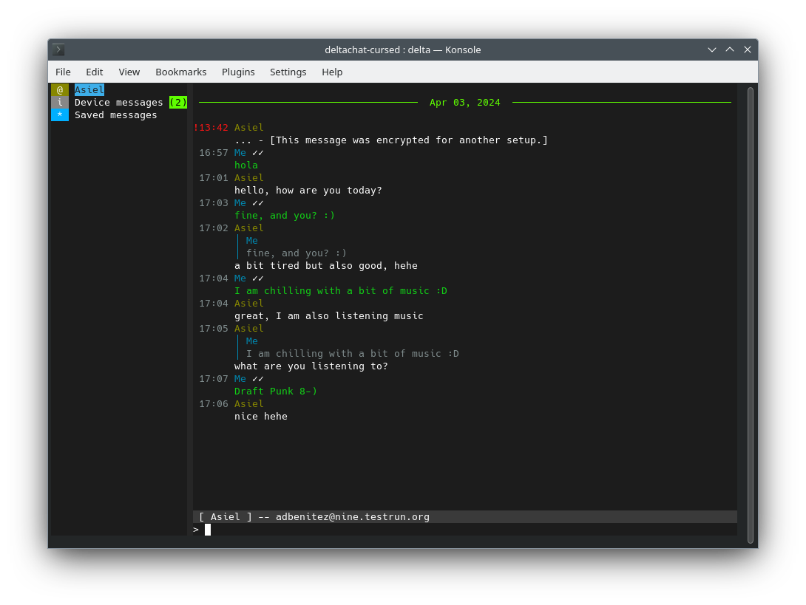

# Cursed Delta

ncurses Delta Chat client developed in Python with the urwid library.

<p align="center">
  
</p>

[](https://pypi.org/project/deltachat-cursed)
[](https://pypi.org/project/deltachat-cursed)
[](https://pepy.tech/project/deltachat-cursed)
[](https://pypi.org/project/deltachat-cursed)
[](https://github.com/adbenitez/deltachat-cursed/actions/workflows/python-ci.yml)
[](https://github.com/psf/black)

## Installation

Install Cursed Delta with pip:

```
$ pip install -U deltachat-cursed
```


## Usage

After installation the command `curseddelta` should be available, or you can use `python3 -m deltachat-cursed`.
The first time you run `curseddelta` you need to specify an email and password:

```
$ curseddelta --email me@example.com --password H4rdPassw0rd
```

Or if you want to use an already existent account:

```
$ curseddelta --db /path/to/your/account.db
```


#### Tips

- Messages will be displayed in red if someone mentions you.
- You will get a notification if someone mentions you in a group.
- The message marker `>` will be gray if the message is encrypted, or red if message is not encrypted.
- Message will be gray until it is sent.
- You will see `✓` at the end of the message if it was send, `✓✓` when the message was noticed, or `✖` if message failed to send.
- You can tweak the app colors editing `~/.curseddelta/theme.json`
- You can tweak the app keymap editing `~/.curseddelta/keymap.json`
- Put global theme, keymap, and config files in `/etc/curseddelta/`
- You can have per-folder config files, the application search for this files in the current working directory: `./curseddelta-theme.json`,  `./curseddelta-keymap.json`, `./curseddelta.conf`
- If you like to use the mouse, you can use the mouse to select chats in the chat list, select the draft area or scroll in the message history.


#### Default Shortcuts

- Press <kbd>Esc</kbd> to leave the draft/editing area.
- Press <kbd>q</kbd> to quit the Cursed Delta.
- Press <kbd>Ctrl</kbd> + <kbd>x</kbd> to toggle the chat list.
- Use <kbd>Meta</kbd> + <kbd>Enter</kbd> to send the message.
- Use <kbd>Ctrl</kbd> + <kbd>r</kbd> to reply last message in chat.
- Use <kbd>Ctrl</kbd> + <kbd>o</kbd> to open attachemnt in the last message in chat.
- You can navigate the chat list with <kbd>Meta</kbd> + <kbd>↑</kbd> and
  <kbd>Meta</kbd> + <kbd>↓</kbd>.
- Vim-like key bindings are also available, use <kbd>h</kbd> <kbd>j</kbd>
  <kbd>k</kbd> <kbd>l</kbd> to navigate between lists, use <kbd>i</kbd>
  to select the draft area and <kbd>Esc</kbd> to leave it.
- For shortcuts in the draft/editing area see: [urwid_readline](https://github.com/rr-/urwid_readline)


### Commands

This are some temporal commands to do things that are not implemented yet using a menu:

- Send `/query user@example.com` to start a chat with `user@example.com`
- Send `/add user@example.com` to add `user@example.com` to the group where the command is sent.
- Send `/kick user@example.com` to remove `user@example.com` from the group where the command is sent.
- Send `/part` in a group to leave it.
- Send `/names` in a group to get the member list in the buffer, use
  <kbd>Ctrl</kbd> + <kbd>l</kbd> to clear.
- Use `/join GroupName` to create a group named `GroupName`
- To send a message starting with `/` use `//`


## Credits

The user interface is based on [ncTelegram](https://github.com/Nanoseb/ncTelegram)


## License

Licensed GPLv3+, see the LICENSE file for details.

Copyright © 2020-2022 Cursed Delta contributors.
